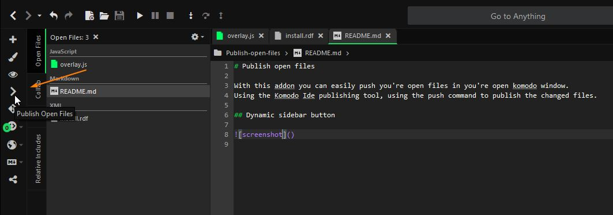
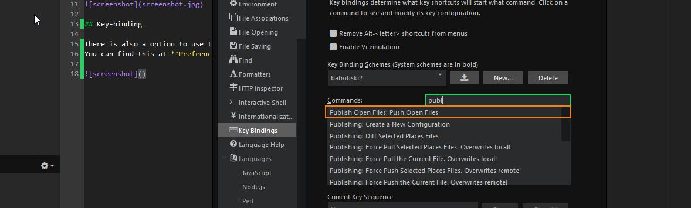

# Publish open files

With this addon you can easily push you're open files in you're open komodo window.  
Using the Komodo Ide publishing tool, using the push command to publish the changed files.  

## Dynamic sidebar button

This addon adds a dynamic sidebar button.
With one click on the button, will publish (push) you're changed open files that are changed in you're editor.

## Key-binding

There is also a option to use this command using a key binding.  
You can find this at **Prefrences > Key Bindings**.

